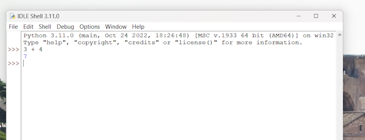

# How to run a Python program

There are a few different ways in which you can run a Python program.

## Running Python scripts

Python can be used as a scripting language; in fact, it always proves itself very useful. Scripts are files (usually of small dimensions) that you normally execute to do something like a task. Many developers end up having their own arsenal of tools that they fire when they need to perform a task. For example, you can have scripts to parse data in a format and render it into another one; or you can use a script to work with files and folders; you can create or modify configuration files—technically, there is not much that cannot be done in a script.

It is rather common to have scripts running at a precise time on a server. For example, if your website database needs cleaning every 24 hours (for example, the table that stores the user sessions, which expire pretty quickly but aren't cleaned automatically), you could set up a Cron job that fires your script at 3:00 A.M. every day.

We have Python scripts to do all the menial tasks that would take us minutes or more to do manually, and at some point, we decided to automate.

## Running the Python interactive shell

Another way of running Python is by calling the interactive shell. This is something we already saw when we typed python on the command line of our console. So, open up a console, activate your virtual environment (which by now should be
second nature to you, right?), and type python. You will be presented with a few lines that should look something like this:

```bash
    username@MACHINENAME MINGW64 ~
    $ python
    Python 3.11.0 (main, Oct 24 2022, 18:26:48) [MSC v.1933 64 bit (AMD64)] on win32
    Type "help", "copyright", "credits" or "license" for more information.
    >>>
```

Run these commands.

```bash
>>> 3 + 7
10
>>> 10 / 4
2.5
>>> 2 ** 1024
179769313486231590772930519078902473361797697894230657273430081157732675805500963132708477322407536021120113879871393357658789768814416622492847430639474124377767893424865485276302219601246094119453082952085005768838150682342462881473913110540827237163350510684586298239947245938479716304835356329624224137216
```

The last operation is showing you something incredible. We raise 2 to the power of 1024, and Python handles this task with no trouble at all. Try to do it in Java, C++, or C#. It won't work, unless you use special libraries to handle such big numbers.

When you use Django (a web framework), the interactive shell is coupled with it and allows you to work your way through the framework tools, to inspect the data in the database, and much more. You will find that the interactive shell soon becomes one of your dearest friends on this journey you are embarking on.

You can open a Python command shell from

> C:\Python311\python.exe

You can also use an IDLE (IDE) that you can execute from the Installed  Apps menu on Windows.



You can open a Python file and run it using **F5**.


## Running Python as a service

Apart from being run as a script, and within the boundaries of a shell, Python can be coded and run as an application. We'll see many examples throughout this book of this mode. We will understand more about it in a moment, when we talk about how Python code is organized and run.

## Running Python as a GUI application

Python can also be run as a Graphical User Interface (GUI). There are several frameworks available, some of which are cross-platform, and some others that are platform-specific. Examples of a GUI application created using **Tkinter**, which is an object-oriented layer that lives on top of Tk (Tkinter means Tk interface). This comes bundled with Python.

## How is Python code organized?

Let's talk a little bit about how Python code is organized. In this section, we will start to enter the proverbial rabbit hole and introduce more technical names and concepts. Starting with the basics, how is Python code organized? Of course, you write your code into files. When you save a file with the extension .py, that file is said to be a Python module.

It would be impractical to save all the code that it is required for software to work within one single file. That solution works for scripts, which are usually not longer than a few hundred lines (and often they are shorter than that).

A complete Python application can be made of hundreds of thousands of lines of code, so you will have to scatter it through different modules, which is better, but not nearly good enough. It turns out that even like this, it would still be impractical to work with the code. So, Python gives you another structure, called a package, which allows you to group modules together. A package is nothing more than a folder that must contain a special file, ``__init__.py``. This does not need to hold any code, but its presence is required to tell Python that this is not just a typical folder—it is actually a
package.

As always, an example will make all of this much clearer. We have created an example structure in our book project, and when we type in the console:

```bash
    tree
```

We will see.

```bash
    $ tree
    .
    |-- core.py
    |-- run.py
    `-- util
        |-- __init__.py
        |-- db.py
        |-- math.py
        `-- network.py

    1 directory, 6 files
```

You can see that within the root of this example, we have two modules, ``core.py`` and ``run.py``, and one package, util. Within ``core.py``, there may be the core logic of our application. On the other hand, within the ``run.py`` module, we can probably find the logic to start the application. Within the util package, we expect to find various utility tools, and in fact, we can guess that the modules there are named based on the types of tools they hold: db.py would hold tools to work with databases, math.py would, of course, hold mathematical tools (maybe our application deals with financial data), and ``network.py`` would probably hold tools to send/receive data on networks. As explained before, the ``__init__.py`` file is there just to tell Python that util is a package and not just a simple folder.

## How do we use modules and packages?

Python is a wonderful language and provides you with all the tools you need to apply the coding best practices. For this particular example, we need to be able to reuse a piece of code. To do this effectively, we need to have a construct that will hold the code for us so that we can call that construct every time we need to repeat the logic inside it. That construct exists, and it's called a **function**.

Python comes with a very extensive library. Now is a good time to define what a library is: a collection of functions and objects that provide functionalities to enrich the abilities of a language. For example, within Python's math library, a plethora of functions can be found, one of which is the factorial function, which calculates the factorial of a number.

So, if you wanted to use this function in your code, all you would have to do is to **import** it and call it with the right input values. Don't worry too much if input values and the concept of calling are not clear right now; please just concentrate on the import part. We use a library by importing what we need from it, which will then be used specifically. In Python, to calculate 5!, we just need the following code:

```python
    from math import factorial
    result = factorial(5)
    print(result)
```

Returns:

> 120

We are using a library module named **math** which has a function named **factorial**. This saves us having to write our own factorial function.

## Python's execution model

In this section, we would like to introduce you to some important concepts, such as scope, names, and namespaces. You can read all about Python's execution model in the official language reference (<https://docs.python.org/3/reference/executionmodel.html>), of course, but we would argue that it is quite technical and abstract, so let us give you a less formal explanation first.

### Names and namespaces

Say you are looking for a book, so you go to the library and ask someone to obtain this. They tell you something like Second Floor, Section X, Row Three. So, you go up the stairs, look for Section X, and so on. It would be very different to enter a library where all the books are piled together in random order in one big room. No floors, no sections, no rows, no order. Fetching a book would be extremely hard.

When we write code, we have the same issue: we have to try and organize it so that it will be easy for someone who has no prior knowledge about it to find what they are looking for. When software is structured correctly, it also promotes code reuse. Furthermore, disorganized software is more likely to contain scattered pieces of duplicated logic.

As a first example, let us take a book. We refer to a book by its title; in Python lingo, that would be a name. Python names are the closest abstraction to what other languages call variables. Names basically refer to objects and are introduced by
name-binding operations. Let's see a quick example.

```bash
    >>> n = 3
    >>> address = "221b Baker Street, NW1 6XE, London"
    >>> employee = {
    ... 'age': 45,
    ... 'role': 'CTO',
    ... 'SSN': 'AB1234567',
    ... }
    >>> n
    3
    >>> address
    '221b Baker Street, NW1 6XE, London'
    >>> employee
    {'age': 45, 'role': 'CTO', 'SSN': 'AB1234567'}
    >>>
```

Remember that each Python object has an **identity**, a **type**, and a **value**. We defined three objects in the preceding code; let's now examine their types and values:

* An integer number n (type: int, value: 3)
* A string address (type: str, value: Sherlock Holmes' address)
* A dictionary employee (type: dict, value: a dictionary object with three key/value pairs)

**Note:** Have you noticed that the prompt changed from >>> to ... when we typed in the definition of employee? That's because the definition spans over multiple lines.

So, what are ``n``, ``address``, and ``employee``? They are **names**, and these can be used to retrieve data from within our code. They need to be kept somewhere so that whenever we need to retrieve those objects, we can use their names to fetch them. We need some space to hold them, hence: **namespaces**!

A **namespace** is a mapping from names to objects. Examples are the set of built-in names (containing functions that are always accessible in any Python program), the global names in a module, and the local names in a function. Even the set of
attributes of an object can be considered a namespace. The beauty of namespaces is that they allow you to define and organize your names with clarity, without overlapping or interference. For example, the namespace associated with the book we were looking for in the library can be used to import the book itself, like this:

> from library.second_floor.section_x.row_three import book

We start from the library **namespace**, and by means of the dot (.) operator, we walk into that namespace. Within this namespace, we look for second_floor, and again we walk into it with the . operator. We then walk into section_x, and finally, within the last namespace, row_three, we find the name we were looking for: **book**.

Walking through a namespace will be clearer when dealing with real code examples. For now, just keep in mind that namespaces are places where names are associated with objects.

There is another concept, closely related to that of a namespace, which we would like to mention briefly: **scope**.

## Scopes

According to Python's documentation:

> "A scope is a textual region of a Python program, where a namespace is directly accessible."

Directly accessible means that, when looking for an unqualified reference to a name, Python tries to find it in the namespace.

Scopes are determined statically, but actually, during runtime, they are used dynamically. This means that by inspecting the source code, you can tell what the scope of an object is. There are four different scopes that Python makes accessible
(not necessarily all of them are present at the same time, of course):

* The local scope, which is the innermost one and contains the local names.
* The enclosing scope; that is, the scope of any enclosing function. It contains non-local names and also non-global names.
* The global scope contains the global names.
* The built-in scope contains the built-in names. Python comes with a set of functions that you can use in an off-the-shelf fashion, such as print, all, abs, and so on. They live in the built-in scope.

The rule is the following: when we refer to a name, Python starts looking for it in the current namespace. If the name is not found, Python continues the search in the enclosing scope, and this continues until the built-in scope is searched. If a name has still not been found after searching the built-in scope, then Python raises a NameError exception, which basically means that the name hasn't been defined.

The order in which the namespaces are scanned when looking for a name is therefore local, enclosing, global, built-in (LEGB).
This is all very theoretical, so let's see an example. In order to demonstrate local and enclosing namespaces, we will have to define a few functions. Don't worry if you are not familiar with their syntax for the moment—that will come later

Just remember that in the following code, when you see def, it means we are defining a function:

```python
    # scopes1.py
    # Local versus Global
    # we define a function, called local
    def local():
        m = 7
        print(m)
    
    # we define m within the global scope
    m = 5
    
    # we call, or `execute` the function local
    local()
    
    print(m)
```

In the preceding example, we define the same name m, both in the global scope and in the local one (the one defined by the local function). When we execute this program with the following command (have you activated your virtual environment?):
Returns:

> $ python scopes1.py       
> 7     
> 5

What happens is that the Python interpreter parses the file, top to bottom. First, it finds a couple of comment lines, which are skipped, then it parses the definition of the function local. When called, this function will do two things: it will set up a name to an object representing number **7** and will print it. The Python interpreter keeps going, and it finds another name binding. This time the binding happens in the global scope and the value is **5**. On the next line, there is a call to the function local. At this point, Python executes the function, so at this time, the binding m = **7** happens in the local scope and is printed. Finally, there is a call to the print function, which is executed and will now print **5**.

One very important thing to note is that the part of the code that belongs to the definition of the local function is **indented** by four spaces on the right. Python, in fact, defines scopes by indenting the code. You walk into a scope by **indenting**, and walk out of it by **unindenting**. Some coders use two spaces, others three, but the suggested number of spaces to use is four. It's a good measure to maximize readability.

What would happen if we removed that **m = 7** line? Remember the LEGB rule. Python would start looking for **m** in the local scope (function local), and, not finding it, it would go to the next enclosing scope. The next one, in this case, is the global one because there is no enclosing function wrapped around local. Therefore, we would see the number **5** printed twice on the console. Let's see what the code would look
like in this case:

```python
    # scopes2.py
    # Local versus Global

    def local():
        # m doesn't belong to the scope defined by the local function
        # so Python will keep looking into the next enclosing scope.
        # m is finally found in the global scope
        print(m, "printing from the local scope")

    m = 5

    print(m, "printing from the global scope")

    local()
```

Returns:

> 5 printing from the global scope      
> 5 printing from the local scope

As expected, Python prints **m** the first time, then when the function local is called, **m** is not found in its scope, so Python looks for it following the LEGB chain until **m** is found in the global scope.

Let's see an example with an extra layer, the enclosing scope:

```python
    # scopes3.py
    # Local, Enclosing and Global

    def enclosing_func():
        m = 13

        def local():
            # m doesn't belong to the scope defined by the local
            # function so Python will keep looking into the next
            # enclosing scope. This time m is found in the enclosing
            # scope
            print(m, "printing from the local scope")

        # calling the function local
        local()

    m = 5

    print(m, "printing from the global scope")

    enclosing_func()
```

Returns:

> 5 printing from the global scope      
> 13 printing from the local scope

As you can see, the print instruction from the function local is referring to **m** as before. m is still not defined within the function itself, so Python starts walking scopes following the LEGB order. This time **m** is found in the *enclosing* scope.

## Objects and classes
